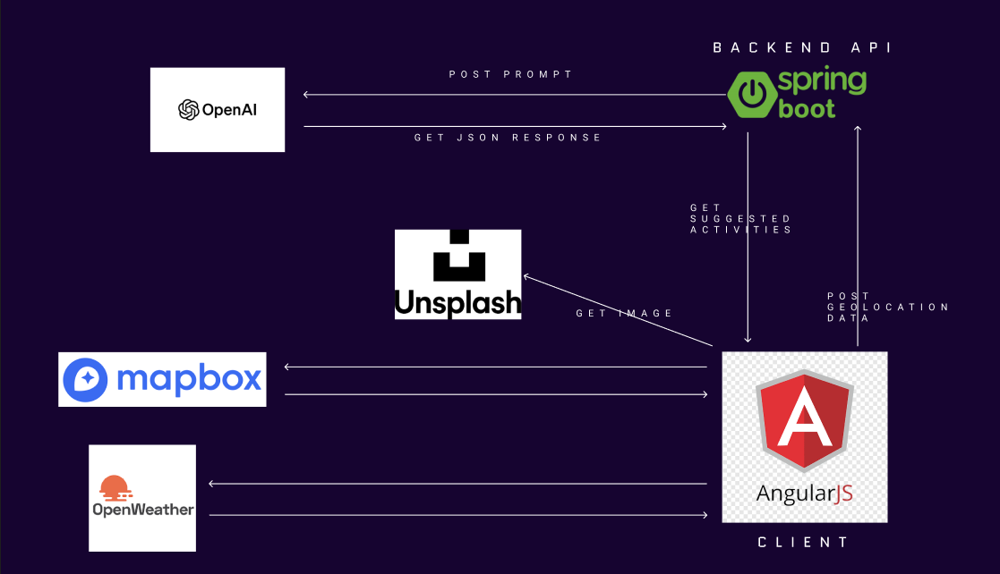

# Local Explorer

## Description
Local Explorer est une application avancée propulsée par l'intelligence artificielle qui offre des recommandations d'activités personnalisées basées sur la localisation actuelle de l'utilisateur, les conditions météorologiques et l'heure. Elle utilise la géolocalisation et une API météo pour accéder aux données météorologiques en temps réel, et s'appuie sur GPT-3 pour générer des suggestions d'activités adaptées aux conditions locales et au moment de la journée. L'application intègre également une API alternative à celle de Google Maps pour suggérer des activités viables. L'objectif est de proposer une interface utilisateur intuitive et engageante qui simplifie la navigation.

## DEMO
Vous trouvere un video demo de l'application nommé "DEMO"

## Comment Utiliser l'Application
Pour mettre en place et utiliser l'application Local Explorer, suivez ces étapes :

1. Obtenir une clé API OpenAI sur : [https://platform.openai.com/api-keys](https://platform.openai.com/api-keys)
2. Cloner le dépôt de code source.
3. Aller dans le répertoire `openai-service` --> `application.properties` et saisir votre clé API comme valeur pour `openai.api.key`.

## Mise en Œuvre
L'interface utilisateur de Local Explorer est construite avec `Angular`, tandis que le back-end est développé avec `Spring Boot`.

## Architecture
 


## APIs Utilisées
- OpenAI API
- OpenWeather API
- Mapbox API (comme alternative à l'API de Google Maps).
- Unsplash images api

## Flux de Données
Lorsque l'utilisateur navigue sur `/explore`, l'application cliente recueille sa position, la météo, l'heure et son identifiant utilisateur, puis envoie ces informations à l'API back-end. L'open-ai-service utilise ces informations pour suggérer des activités. Avant d'afficher les activités à l'utilisateur, un filtre est appliqué aux activités en fonction du poids de l'activité, comme défini dans la méthode updateWeight() qui ajuste le poids en fonction du taux de déclin, de la pénalité d'interaction et d'un boost pour les favoris, en utilisant les heures écoulées depuis la dernière suggestion et le nombre d'interactions.
```java
public void updateWeight() {
    double decayRate = 0.1;
    double interactionPenalty = 0.05;
    double favoriteBoost = 1.5;

    long hoursSinceLastSuggested = ChronoUnit.HOURS.between(this.lastSuggested, LocalDateTime.now());
    double timeDecay = Math.exp(-decayRate * hoursSinceLastSuggested);

    double interactionDecay = 1 / (1 + this.interactionCount * interactionPenalty);

    if (this.isFavourite) {
        double favoriteDiminishFactor = 1 / (1 + this.interactionCount * (interactionPenalty / 2));
        this.weight = (timeDecay * favoriteBoost * favoriteDiminishFactor) * interactionDecay;
    } else {
        this.weight = timeDecay * interactionDecay;
    }
}
